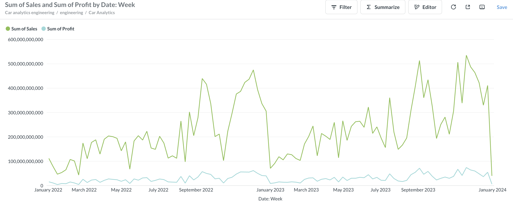
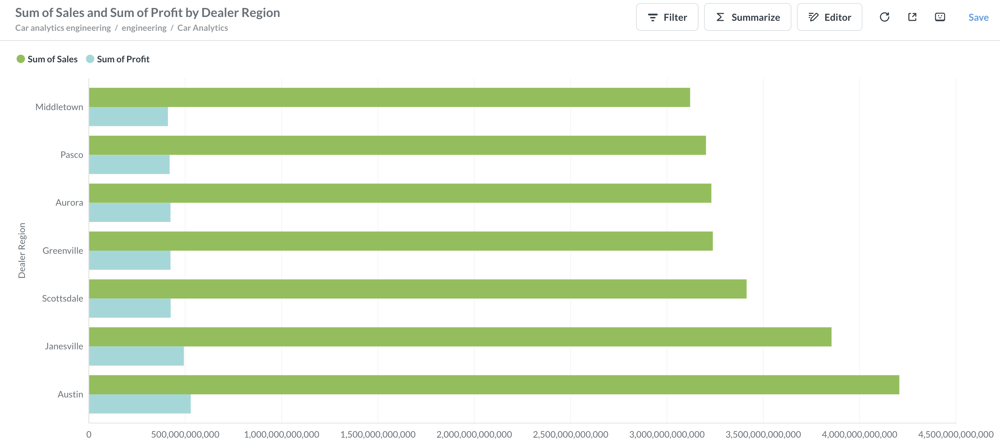

## 🏎️ Project structure for enterprise Car analytics Engineering

- Build PostgreSQL database for Car sales projection
    
- Metabase as Data Visualization to ensure data analytics projection
    - Sum of Sales and Sum of Profit by Date Month
    
    - Sum of Sales and Sum of Profit by Date Week
    
    - Sum of Sales and Sum of Profit by Dealer Region
    
- ML Prediction divide into 2 model
    - Model 1 - Demand Prediction
    Business Question:
    How many cars will a customer purchase?
    - Model 2 - Revenue Forecasting
- Sales prediction on visual graph data visualization
    - Comparison ML models for sales prediction
    

## 📝 Important notes
- Demand Prediction
    Your current R² (~0.34) suggests there is room for improvement. I would:
- Apply a log transform to `income_customer` if it's highly skewed.
- Consider treating high-cardinality categorical features (`dealer_name`, `model`) with CatBoost's native categorical handling rather than label encoding.
- Add richer business features if available (financing type, dealership inventory, holiday indicators, prior customer purchases).

- Revenue Forecasting
    Decide which business problem you want to solve:
- **Forecast future revenue**: remove features that wouldn't be known at prediction time (`quantity`, `customers`, `avg_price`, `avg_discount`) and rely on historical lags and calendar information.
- **Estimate revenue during operations**: your current feature set is appropriate, and the very high R² is expected because `quantity` and `customers` are strong real-time indicators of revenue.